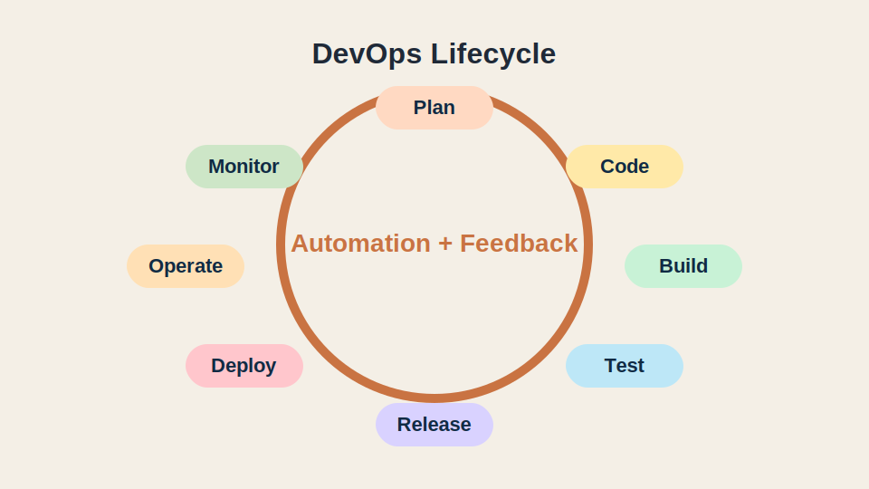
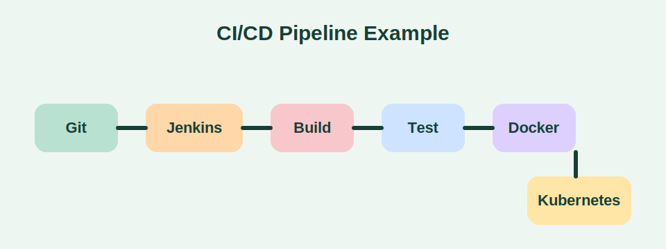
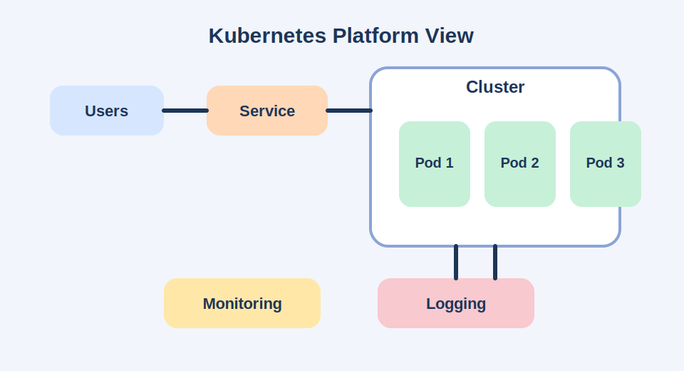

# DevOps Foundations

This repository now includes a beginner-friendly guide to the core DevOps topics below:

- Version Control
- CI/CD with Jenkins
- Configuration Management with Ansible and Terraform
- Containerization with Docker
- Container Orchestration with Kubernetes
- Monitoring and Logging in DevOps

## What Is DevOps?

DevOps is a way of working that brings development and operations together so teams can build, test, release, and run software faster and more reliably. It focuses on automation, collaboration, repeatability, and visibility.

## 1. Version Control

Version control helps teams track changes in source code, collaborate safely, and recover old versions when needed. The most common tool is Git.

### Why it matters

- Keeps a history of code changes
- Supports team collaboration
- Makes rollback possible
- Enables branching and pull request workflows

### Common Git commands

```bash
git init
git clone <repository-url>
git status
git add .
git commit -m "Add feature"
git pull origin main
git push origin main
git checkout -b feature/login
```

### Basic workflow

1. Create a branch for a task
2. Make code changes
3. Commit with a clear message
4. Push to the remote repository
5. Open a pull request
6. Review, merge, and deploy

## 2. CI/CD with Jenkins

CI/CD means Continuous Integration and Continuous Delivery/Deployment.

- Continuous Integration: developers merge code frequently and run automated tests
- Continuous Delivery: the software is always in a releasable state
- Continuous Deployment: every successful change is automatically deployed

Jenkins is a popular automation server used to build pipelines.

### Jenkins pipeline stages

1. Checkout source code
2. Install dependencies
3. Build the application
4. Run tests
5. Package artifacts
6. Deploy to staging or production

### Example Jenkinsfile

```groovy
pipeline {
  agent any

  stages {
    stage('Checkout') {
      steps {
        git 'https://github.com/example/devops-demo.git'
      }
    }

    stage('Build') {
      steps {
        sh 'npm install'
        sh 'npm run build'
      }
    }

    stage('Test') {
      steps {
        sh 'npm test'
      }
    }

    stage('Deploy') {
      steps {
        echo 'Deploying application'
      }
    }
  }
}
```

## 3. Configuration Management with Ansible and Terraform

These two tools solve different infrastructure problems.

### Ansible

Ansible is used for configuration management and server automation. It is agentless and usually connects over SSH.

### Terraform

Terraform is used for Infrastructure as Code. It provisions cloud resources such as VMs, networks, databases, and Kubernetes clusters.

### Difference in simple terms

- Ansible configures systems
- Terraform creates infrastructure

### Example Ansible playbook

```yaml
---
- name: Install Nginx
  hosts: web
  become: true

  tasks:
    - name: Install nginx package
      apt:
        name: nginx
        state: present
        update_cache: true
```

### Example Terraform configuration

```hcl
provider "aws" {
  region = "us-east-1"
}

resource "aws_instance" "web" {
  ami           = "ami-12345678"
  instance_type = "t2.micro"

  tags = {
    Name = "devops-web"
  }
}
```

## 4. Containerization with Docker

Docker packages an application and its dependencies into a container so it runs the same way in different environments.

### Benefits

- Consistent environments
- Faster deployments
- Easier scaling
- Better portability

### Example Dockerfile

```dockerfile
FROM node:20-alpine

WORKDIR /app

COPY package*.json ./
RUN npm install

COPY . .

EXPOSE 3000

CMD ["npm", "start"]
```

### Common Docker commands

```bash
docker build -t my-app .
docker run -p 3000:3000 my-app
docker ps
docker stop <container-id>
docker images
```

## 5. Container Orchestration with Kubernetes

Kubernetes manages containers at scale. It helps deploy, scale, heal, and expose containerized applications.

### Important Kubernetes objects

- Pod: smallest deployable unit
- Deployment: manages pod replicas and updates
- Service: exposes pods internally or externally
- ConfigMap: stores non-secret configuration
- Secret: stores sensitive data
- Namespace: logical separation for resources

### Example Kubernetes deployment

```yaml
apiVersion: apps/v1
kind: Deployment
metadata:
  name: my-app
spec:
  replicas: 2
  selector:
    matchLabels:
      app: my-app
  template:
    metadata:
      labels:
        app: my-app
    spec:
      containers:
        - name: my-app
          image: my-app:latest
          ports:
            - containerPort: 3000
---
apiVersion: v1
kind: Service
metadata:
  name: my-app-service
spec:
  selector:
    app: my-app
  ports:
    - port: 80
      targetPort: 3000
  type: LoadBalancer
```

## 6. Monitoring and Logging in DevOps

Monitoring and logging help teams understand system health, detect failures early, and troubleshoot issues faster.

### Monitoring

Monitoring tracks metrics such as:

- CPU usage
- Memory usage
- Response time
- Error rate
- Disk usage
- Network traffic

Common tools:

- Prometheus
- Grafana
- Datadog
- Nagios

### Logging

Logging collects application and system events.

Common tools:

- ELK Stack (Elasticsearch, Logstash, Kibana)
- EFK Stack (Elasticsearch, Fluentd, Kibana)
- Loki
- Splunk

### Why both are needed

- Monitoring tells you that something is wrong
- Logging helps explain why it is wrong

## DevOps Flow

The full flow usually looks like this:

1. Developers write code
2. Code is stored in Git
3. Jenkins runs CI/CD pipeline
4. Terraform provisions infrastructure
5. Ansible configures servers
6. Docker packages the app
7. Kubernetes deploys and scales containers
8. Monitoring and logging observe the system

## Example Images

### DevOps lifecycle



### CI/CD pipeline



### Kubernetes platform view



## Short Summary

DevOps combines software development and IT operations to deliver software quickly and reliably. Git manages code changes, Jenkins automates CI/CD, Terraform creates infrastructure, Ansible configures systems, Docker packages applications, Kubernetes manages containers, and monitoring plus logging keep production systems observable and stable.

## How To Study These Topics

1. Learn Git basics and practice branching
2. Build one Jenkins pipeline
3. Write one Ansible playbook
4. Provision one simple resource with Terraform
5. Create and run one Docker container
6. Deploy that container to Kubernetes
7. Add monitoring dashboards and log collection

## Conclusion

These topics form a strong DevOps foundation. Once you understand how they connect, you can design delivery pipelines that are faster, safer, and easier to maintain.
